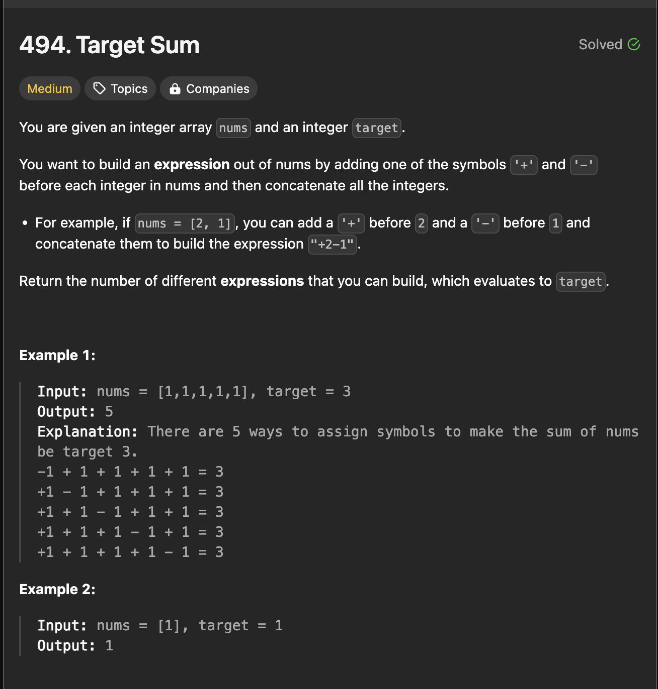
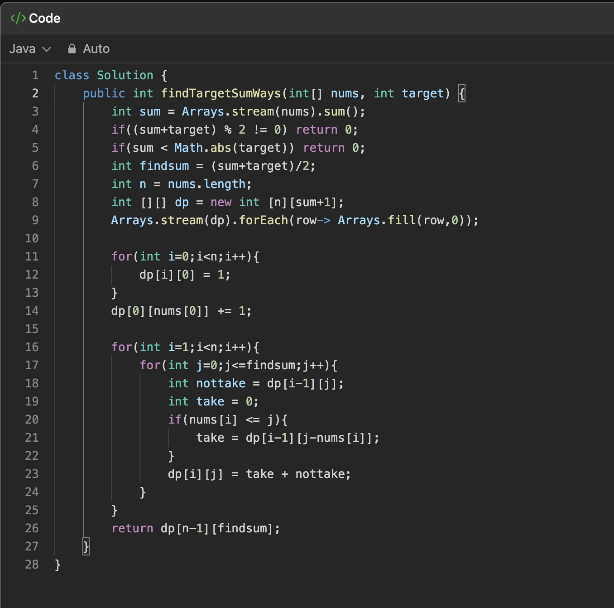

## Description :

## Approach :

It is similar Partition Two Div Min Sum like that 

here we need add ++ and -- simblos 
so we can partion the array into two array and take their substaraction 

so then want a target = 3

we can do this by calculating the find sum = (totalsum + target)/2.

## Solution :

